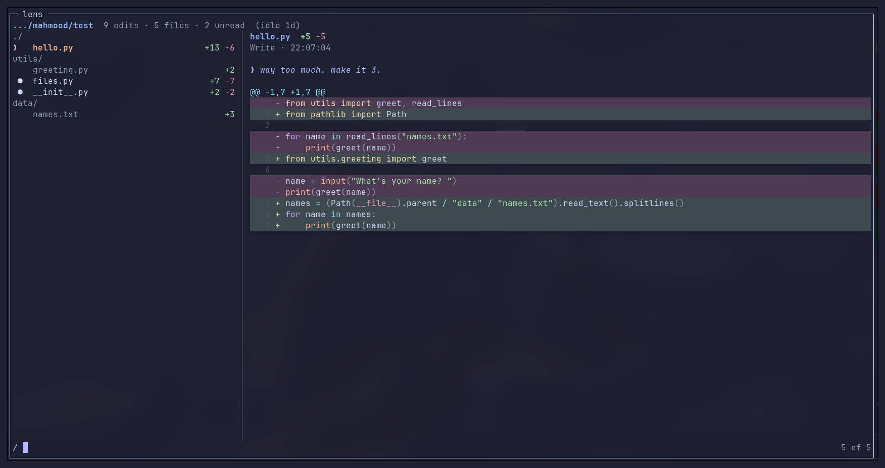
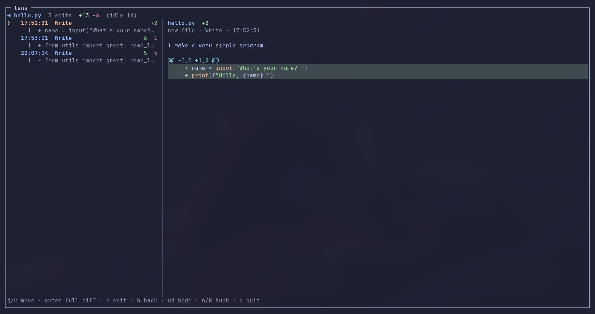
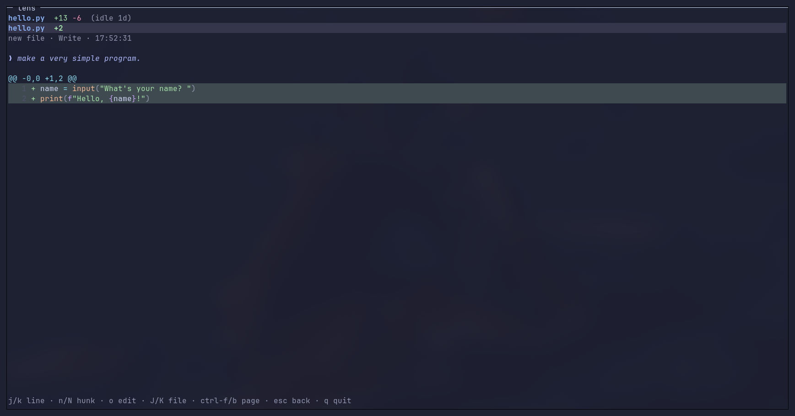

# lens

A panel that shows what Claude Code changes in your code, as it happens, so you
can read it rather than scroll past it.



It pops up by itself in a tmux popup when Claude finishes a turn that changed
files — a turn that only answered a question leaves it closed — lists the files
on the left and the newest diff on the right, and moves under vim motions. A
popup holds the keyboard, so it is scrollable the moment it appears — there is
no pane to switch to first. Each diff carries the prompt that caused it, so you
see the request and the code that satisfied it side by side.

The list has two levels. At the top it is the files, grouped under the directory
they live in so a path is said once rather than on every row. `l` goes into the
file under the cursor: the other files give way to that file's own history —
each edit, with the hunks it made listed under it, named by line number and the
first line they changed. Picking a hunk jumps the diff to it, so a file with a
past can be read one change at a time. `h` or `esc` comes back out.



`enter` is the same journey in one key — into the file, then into a full-width
diff with no list beside it at all. `J`/`K` move to the next file at any depth,
so file after file can be read without backing out, and `esc` retraces each
step.



`o` opens what you are looking at in your editor and stands aside — the hunk
under the cursor, or the line the diff cursor is on. It hands the file to the
nvim already working on that project, over the socket nvim leaves behind, and
asks for `drop`: a file already on screen is jumped to rather than opened twice.
The editor is usually in another tmux window, so that window is brought forward
too. With no editor on the project, one is started in a window of its own, working a
level above the file — near enough that its siblings are to hand, and never at
`$HOME`, where an editor is rooted at everything. A file whose parent would be
home settles for its own directory instead.

`dd` clears whatever the cursor is on out of the view — a file, one edit to it,
or a single hunk — which is how you put down what you have finished reading.
Nothing on disk is touched; the files and the capture are left exactly as they
were. `u` walks that back one `dd` at a time and `ctrl-r` replays it, so you can
return to any earlier point. The status line says how many rows are hidden, and
counts only what is left.

What you put down is kept with the session, next to its read state, so closing
the popup and reopening it finds the list as you left it — and `u` still reaches
back past the reopen. Another session has its own history and opens untouched.

It opens ready to search: type to filter the list by file name, `⏎` to keep the
filter, `esc` to clear it. Changes you have not looked at carry a `●` and
stay bright; once you land on one it dims — and a file lights up again when
Claude touches it afresh. Read state is kept per session, so closing
the popup and reopening it does not present everything as new again.

The diff is coloured with the same palette as the editor beside it,
syntax and all, including added and removed lines — what marks those is a wash
of green or red behind the code rather than flattening it to one colour. The
colours are not an approximation of the theme, nor a reading of its source:
they are asked of the editor itself. When the panel opens it queries the nvim
working on that project for what it draws each highlight group with, group by
group, so the diff matches whatever colourscheme you actually use. With no
editor running it falls back to a built-in tokyonight-moon. The
washes are its `DiffAdd`, `DiffDelete` and `CursorLine`, taken whole. Comments
and docstrings come out italic, as they do in the editor.

A file type the highlighter has never heard of used to come out as a wall of
plain text — `.bats`, `.tmux`, `.conf` and friends have no lexer of their own.
Those borrow one that reads close enough (a bats file is bash with a test
harness, a justfile is a makefile), and a file with no useful name at all is
identified from the code the edit touched, a shebang included.

One thing does not survive the crossing: the editor draws `if` and `for` in
magenta but a bare `defer` or `return` in italic pink, and the highlighter here
has no token that tells them apart. Keywords take the magenta, which is what
most of them are. `tab` gives the
diff a cursor of its own; `ctrl-e`/`ctrl-y` and `ctrl-f`/`ctrl-b` scroll it from
either pane, so a long hunk never needs a focus change to read.

Edits are recorded silently while Claude works and shown once, at the end:
opening a popup mid-turn would take the session away from you while you are
still talking to it.

## Requirements

- **tmux.** The panel is a tmux popup over your session; without tmux there is
  nowhere for it to open. Run Claude Code inside tmux.
- **Claude Code**, installed and run at least once, so `~/.claude` exists.
- **Go 1.25 or newer**, to build from source — or take a prebuilt binary and
  skip Go entirely.
- **nvim**, optional: `o` hands a file to the editor already open on the
  project, and the diff takes its colours from that editor when one is running.

## Install

From a release, with no Go needed:

```sh
curl -L -o ~/.local/bin/lens \
  https://github.com/mahmoodana1/lens/releases/latest/download/lens_linux_amd64
chmod +x ~/.local/bin/lens
~/.local/bin/lens hooks install
```

Or from source:

```sh
./install.sh
```

Either way this puts `lens` in `~/.local/bin` and adds five hooks to
`~/.claude/settings.json` — backing it up first, and leaving every other tool's
hooks alone. Restart Claude Code to load them. The panel then appears on its
own. Run it again to upgrade: lens replaces its own hook entries rather than
stacking up new ones.

If nothing seems to happen, ask:

```sh
lens doctor
```

It checks each thing that has to be true — hooks wired, tmux reachable, this
project not muted, edits actually landing — and says which one is not, with the
command to fix it. It exits non-zero only when something is actually stopping
the panel working, so a note about a muted project does not fail a script.

To remove it again:

```sh
./uninstall.sh
```

That takes the hooks out and deletes the binary. Your capture logs are left
where they are, and it tells you where that is.

To bring it back after you have closed it, bind a key to `lens popup`:

```tmux
bind e run-shell "~/.local/bin/lens popup"
bind E run-shell "cd '#{pane_current_path}' && ~/.local/bin/lens auto toggle"
```

The second binding turns the automatic popup off and on **for the project you
are in** — `lens auto [--project DIR] [on|off|toggle|status]`, defaulting to the
working directory. That is why the binding runs it from the pane's own path: a
key binding's command otherwise inherits the tmux server's directory. The verb
and the flag may come in either order, and the directory is resolved to an
absolute, symlink-free path, so a relative `--project .` names the same project
the hook does.

Both bindings act on the project of the pane you press them in. `lens popup`
asks tmux what the pane is working in, so the panel that opens is that
project's session rather than whichever session was written to most recently —
which, since reading a panel touches its session, is otherwise often another
window's. `lens [popup] --project DIR` names one explicitly.

Capture keeps running while it is off, so the next `lens popup` still shows
everything that happened, and turning it back on catches up rather than skipping
what it missed. Muted projects are listed in
`$XDG_STATE_HOME/lens/auto-open-off`, one path per line.

## Keys

| Key | Action |
|---|---|
| `j` / `k` | move down / up |
| `/` | filter by file name; `⏎` keeps it, `esc` clears it |
| `ctrl-j` / `ctrl-k` | move through the results while the prompt is open |
| `ctrl-e` / `ctrl-y` | scroll the diff a line, from either pane |
| `ctrl-f` / `ctrl-b` | scroll the diff a page, from either pane |
| `ctrl-d` / `ctrl-u` | half page |
| `gg` / `G` | first / last |
| `n` / `N` | next / previous hunk |
| `J` / `K` | next / previous file, at any depth |
| `l` / `space` | open the file: its edits, and the hunks they made |
| `h` / `esc` | back out a level |
| `enter` | one level in: the file, then its full-width diff |
| `f` | the full-width diff from anywhere |
| `o` | open where you are looking, in nvim |
| `dd` | clear the file, edit or hunk out of the view |
| `u` / `ctrl-r` | undo / redo one `dd` |
| `+` / `-` | more / less surrounding context |
| `Tab` | focus the list or the diff; the diff gets its own cursor |
| `●` | marks a change you have not looked at yet |
| `?` | help |
| `q` | close the popup (the capture stays; reopen with your `lens popup` key) |

## Commands

| Command | |
|---|---|
| `lens` | the panel itself, as the popup runs it |
| `lens popup` | open the panel over the current tmux pane, for that pane's project |
| `lens auto [on\|off\|toggle\|status]` | whether the panel opens by itself, per project |
| `lens doctor` | why the panel is not showing anything |
| `lens hooks install\|remove` | wire it into Claude Code, or take it out |
| `lens --version` | |

## How it works

Claude Code's `PostToolUse` hook already carries a `structuredPatch` and the
file's prior contents, so edits made with the Edit and Write tools need no
snapshotting or re-diffing.

Files written by shell commands — heredocs, `sed -i`, code generators — report
nothing about what they touched, so those are found by watching the project:
`SessionStart` records what it looked like beforehand, and after each Bash call
a stat-walk finds what moved and diffs it. Build output, dependencies, binaries
and large files are skipped; `$HOME` and `/` are never walked.

The walk never leaves the project, and never enters anything hidden — as a root
any more than as a directory it descends into. It sweeps whole directories, so a
single shell command naming `~/.config` was once enough to adopt it wholesale:
thirteen thousand files indexed, and the project itself never watched. Paths a
command names are resolved against the directory that command ran in, not
lens's own, or an agent working in a subdirectory has its files looked for in
the wrong place. A single shell command naming a path in `/tmp` used to be
enough to adopt it as a root and fill the panel with other programs' scratch
files — Claude Code's own temp
repositories for diffing shell edits, a plugin's preload files. Roots named by a
command are still picked up, which is how a project created mid-session gets
watched, but only inside the directory the session started in. An index that
strayed before is pruned rather than merely stopped.

An edit made deliberately with the Edit or Write tool is a different matter:
someone meant it, so it is recorded wherever the file lives.

Nothing hidden is recorded at all, by either route: if any part of a path starts
with a dot — the file itself or a directory on the way to it — the change is
turned away rather than logged. That is `.git`, `.venv`, `.cache`, an editor's
or an agent's own state, and `.gitignore` alike, without a list of names that
would always be one entry behind. A hidden directory is not even descended into.
The question is asked of the path relative to the project root, so a project
that lives somewhere hidden is not hidden from itself: in `~/.config/nvim`,
`init.lua` is an ordinary file. Older logs that already hold such edits have
them dropped when the panel reads them.

Paths are shortened against the directory the session started in, not the one
the agent happens to be in: an agent that changes into a subdirectory starts
calling the same file something shorter, and a file named two ways is a file
listed twice. The panel re-measures older logs the same way, since it is the
absolute path a change records that is trustworthy, not the short name.

Each change is appended to `$XDG_STATE_HOME/lens/<session>/events.jsonl`; the
panel tails it. `UserPromptSubmit` records prompts, joined to edits by
`prompt_id`.

The panel is opened for edits, not for turns: `announced` records the highest
edit it has been opened for, and a turn whose edits are all below that opens
nothing.

What the reader does with the panel is kept per session too: `seen` holds the
edits already read and `dismissed.json` the trail of `dd`s, both under the
session's own directory.

Storage is per-session and ephemeral. Closing the popup leaves the log alone so
you can reopen it, and `SessionEnd` only marks the session finished — the panel
stays readable afterwards. Logs are swept 24 hours after their last change.

## Testing a fresh install

The unit tests cover the parts. What they cannot cover is the thing most likely
to go wrong for somebody else: a machine that has never seen lens, has no
`~/.claude`, no hooks, no capture logs, and possibly no Go.

```sh
./test/fresh-install.sh           # in throwaway containers
./test/fresh-install.sh --local   # no docker: a throwaway HOME on this machine
./test/fresh-install.sh --release # also check the published release assets
```

It installs both documented ways — `./install.sh` on a machine with Go, and a
prebuilt binary wiring itself in on a machine without — then fires the real
hook payloads Claude Code sends, draws the panel in a real tmux and reads the
screen back, and uninstalls. Along the way it checks that installing twice
upgrades rather than duplicating, that another tool's hooks and settings survive
both, that nothing hidden reaches the log or the screen, and that the doctor
fails only on what actually stops the panel working. Your own install is never
involved: the repo is mounted read-only, HOME is a temporary directory, and tmux
gets a server on its own socket rather than the one you are sitting in.

The same checks run on every push, where the runner is genuinely a machine that
has never seen lens.

## Releasing

`var version` in `main.go` carries a `-dev` suffix on master and names the
release being worked towards, so a source install reports what it actually is
rather than claiming to be the last tag. A test enforces the suffix, and the
release workflow refuses to publish a `-dev` build.

1. `./test/fresh-install.sh` — both install paths, on clean machines.
2. Set `var version` to the release: `0.1.2-dev` → `0.1.2`. Commit.
3. `git tag v0.1.2 && git push --tags`. The workflow builds four platforms,
   checks the binary reports `0.1.2`, and publishes them with `SHA256SUMS`.
4. Bump `var version` to the next `-dev` (`0.1.3-dev`) and commit, so master is
   never mistaken for a release.
5. `./test/fresh-install.sh --release` — the published assets, as a friend
   downloads them.

See `docs/superpowers/specs/` for the design and `docs/superpowers/plans/` for
the implementation plan.
